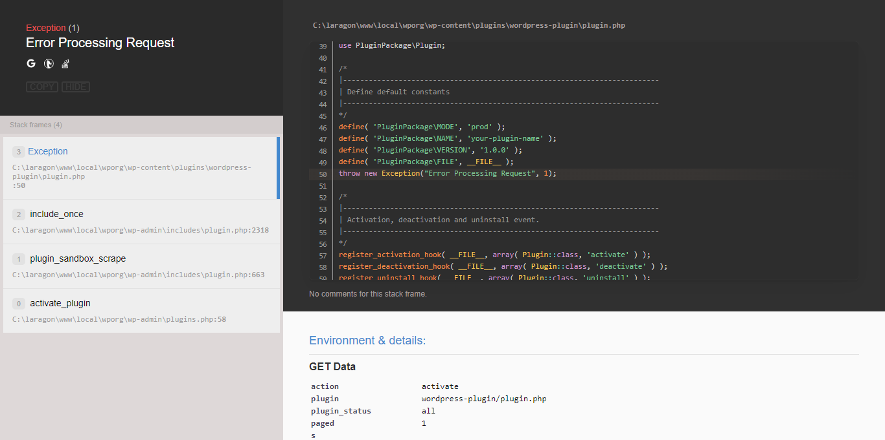

# WordPress Debugger

WordPress Debugger is a straightforward tool designed to assist you in identifying and resolving errors on your WordPress website.

## Installation

To install, simply download the tool as a zip file and follow the standard WordPress plugin installation process.

## Requirements

This tool is compatible with PHP versions ranging from 7.1 to 8.1.

## Output

Upon successful execution, you’ll see the results as shown in the included image

