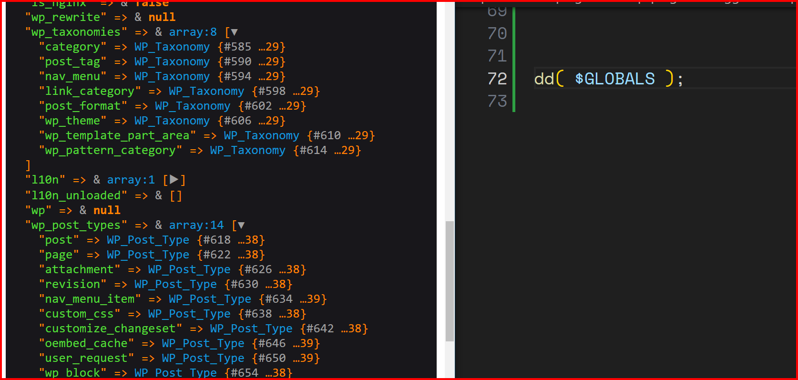

# WordPress Debugger

WordPress Debugger is a tool designed to identify and resolve errors on a WordPress website.

## Installation

To install, download the tool as a zip file and follow the standard WordPress plugin installation process.

## Requirements

This tool is compatible with PHP versions 7.1 to 8.1.

## Output

Upon successful execution, you’ll see the results as shown in the included image


### Dump any variable data
- dump a variable using the `dump` function
- dump a variable and stop execution using the `dd` function


### Write a log to debug the API response

```php
DevKabir\WPDebugger\write_log( 'Plugin Loaded' ); // Write log in the plugin directory.
DevKabir\WPDebugger\write_log( 'Plugin Loaded', __DIR__ ); // Write log in the directory where the function is called.
```